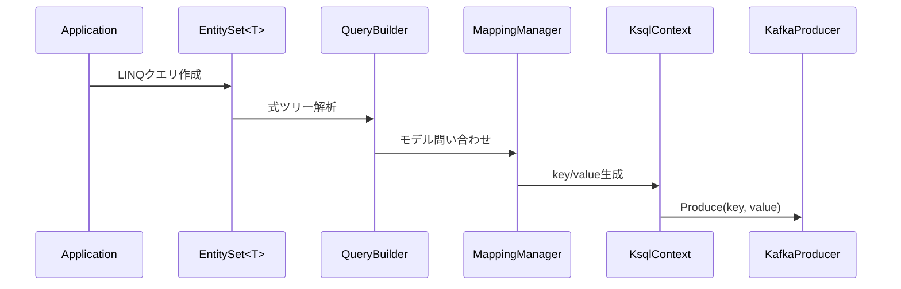

# Key-Value Flow Architecture (POCO ↔ Kafka)

## 1. 概要

本資料は、Query namespace に定義された POCO および LINQ式から Kafka へ送信するフロー（Produce）と、Kafka から受信して POCO に復元するフロー（Consume）を一貫して設計するための責務分解図である。

---

## 2. 全体構造図（双方向）

[Query] ⇄ [KsqlContext] ⇄ [Messaging] ⇄ [Serialization] ⇄ [Kafka]


## 3. Produce Flow（POCO → Kafka）

[Query/EntitySet<T>]
↓ LINQ式, POCO
[KsqlContext/ExtractKeyValue()]
↓ T → key, value
[Messaging/IKafkaProducer<T>.Produce()]
↓ key, value
[Serialization/AvroSerializer]
↓ byte[]
[Kafka]
→ Topic送信

yaml
コピーする
編集する

### 🧱 責務一覧

| レイヤー     | クラス名             | 主な責務                                  |
|--------------|----------------------|-------------------------------------------|
| Query        | EntitySet<T>         | LINQ式とPOCOを提供                         |
| KsqlContext  | ExtractKeyValue()    | LINQ式に基づく key-value抽出              |
| Messaging    | IKafkaProducer<T>    | メッセージ送信、トピック指定              |
| Serialization| AvroSerializer       | key/value の Avro変換（Confluent）        |
| Kafka        | Kafka Broker         | メッセージ配信                            |

---

## 4. Consume Flow（Kafka → POCO）

[Kafka]
↓ メッセージ受信
[Serialization/AvroDeserializer]
↓ key, value（byte[] → object）
[Messaging/IKafkaConsumer<TKey, TValue>]
↓ POCO再構成（TKey, TValue）
[Application/Callback or Pipeline]
→ アプリケーションロジックへ渡す


### 🧱 責務一覧

| レイヤー     | クラス名               | 主な責務                                     |
|--------------|------------------------|----------------------------------------------|
| Kafka        | Kafka Broker           | メッセージ受信                                |
| Serialization| AvroDeserializer       | Avro → POCO 変換（Confluent）                |
| Messaging    | IKafkaConsumer<TKey, TValue> | メッセージ処理, POCO復元                 |
| Application  | Consumer Handler       | アプリロジックへの通知・後処理              |

---

## 5. 注意点

- 全体のKey定義はLINQ式で統一（POCOの属性依存を排除）。
- key/valueのAvro変換はConfluent公式に完全依存。
- `IKafkaConsumer` は再生成されたTKey/TValueの型安全性を保持。
- 各構成はDIにより初期化、KsqlContextが統括。

## 6. 利用シナリオ: EntitySet から Messaging まで

LINQ クエリをどのように `Kafka` 配信までつなぐかを示すため、代表的なシーケンスとコード例を以下にまとめる。

## 7. 運用フロー詳細

1. POCO定義・LINQ式生成
    - Query namespaceでPOCO（およびLINQ式）を受け付け、key/valueプロパティ配列を取得。
    - keyが未指定の場合は、Query層でGuidを自動割当。
1. Mapping登録処理
    - KsqlContextが、POCO＋key/value情報をMappingに一括登録。
    - DLQ POCOもCore namespaceから登録（produce専用）。
1. KSQLクラス名生成
    - POCOのnamespace＋クラス名から一意なKSQL schema名を生成。
    - スキーマ登録時と必ず一致する仕様で統一。
1. スキーマ登録
    - schema registryに対し、KSQLクラス名でスキーマを登録。
1. インスタンス生成
    - POCO単位でMessaging/Serializationインスタンスを生成。
    - OnModelCreating直後に必ず上記一連の処理を実施。


### シーケンス図



### サンプルコード

```csharp
var ctx = new MyKsqlContext(options);
var set = ctx.Set<User>();

var query = set.Where(u => u.Id == 1);
var builder = new QueryBuilder(ctx.Model);
var mapping = ctx.MappingManager;

var ksql = builder.Build(query);
var entity = new User { Id = 1, Name = "Alice" };
var parts = mapping.ExtractKeyParts(entity);
var key = KeyExtractor.BuildTypedKey(parts);
await ctx.AddAsync(entity);
```

複合キーは `List<(string KeyName, Type KeyType, string Value)>` として抽出し、送信時に `BuildTypedKey` で型変換する方式へ移行しました。既存の `ExtractKeyValue` は互換APIとして残ります。

### ベストプラクティス

- `MappingManager` へ登録するモデルは `OnModelCreating` で一括定義する。
- `QueryBuilder` から返される KSQL 文はデバッグログで確認しておく。
- `KsqlContext` のライフサイクルは DI コンテナに任せ、使い回しを避ける。

### アンチパターン

- `MappingManager` を毎回 `new` して登録し直す。 → モデル漏れや性能低下につながる。
- LINQ クエリ側で複雑なロジックを組み込み、`QueryBuilder` の解析失敗を誘発する。

### 異常系の流れ

1. `MappingManager` に登録されていないエンティティを渡した場合、`InvalidOperationException` が発生する。
2. `KsqlContext` との接続に失敗した場合は `KafkaException` を上位へ伝搬する。

