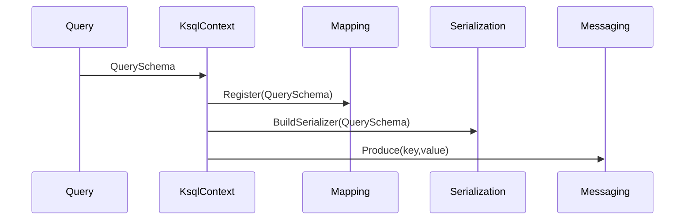

# Query -> KsqlContext -> Mapping/Serialization Flow

🗕 2025-07-13 17:55 JST
🧐 作成者: assistant

Query namespace で組み立てた DSL から Messaging 層までの責務分界とデータフローを
整理する。Messaging 再設計前の基準として、各レイヤーの役割と API 例を明記する。

## 1. 目的
- Query は LINQ 式から論理的な Key/Value 分割とメタ情報 (`QuerySchema`) を返す。
- KsqlContext は `QuerySchema` を受け取り Mapping/Serialization へ変換指示する統括
  レイヤーとなる。
- Mapping/Serialization は POCO と Key/Value との相互変換、およびシリアライズ／
  デシリアライズ処理を担当する。
- Messaging は key/value の送受信 API のみを担う。

## 2. 責務一覧
| レイヤー | 主なクラス/IF | 責務概要 |
| --- | --- | --- |
| Query | `EntitySet<T>`, `QueryAnalyzer` | LINQ 式解析、`QuerySchema` 提供 |
| KsqlContext | `KsqlContext`, `KsqlContextBuilder` | `QuerySchema` 登録、Mapping/Serialization への橋渡し |
| Mapping | `MappingManager`, `PocoMapper` | `QuerySchema` を用いた POCO⇔Key/Value 変換 |
| Serialization | `AvroSerializerFactory` 等 | Key/Value のシリアライズ／デシリアライズ |
| Messaging | `KafkaProducerManager`, `KafkaConsumerManager` | POCO を Avro へ変換して送信、受信時は Avro から POCO へ復元 (Serializer/Deserializer はキャッシュ) |

## 3. データフロー


1. `EntitySet<T>` から `QueryAnalyzer` が `QuerySchema` を生成。
2. `KsqlContext` が `QuerySchema` を保持し、`MappingManager` へ登録。
3. `KsqlContext` が `AvroSerializerFactory` へスキーマ情報を渡し、Serializer を生成。
4. 生成された Key/Value は Messaging の `AddAsync(key,value)` へ渡され送信される。

## 4. API 例
```csharp
// Query 側でメタ情報取得
var result = QueryAnalyzer.Analyze<User, User>(q => q.Where(u => u.Id == 1));
var schema = result.Schema!;

// KsqlContext で登録
var ctx = new MyKsqlContext(options);
ctx.RegisterQuerySchema<User>(schema);

// Mapping/Serialization を通じて送信
var (key, value) = PocoMapper.ToKeyValue(user, schema);
await ctx.Messaging.AddAsync(key, value);
```

## 5. Messaging 最小 API
- `Task AddAsync(byte[] key, byte[] value, string topic);`
- `IAsyncEnumerable<(byte[] Key, byte[] Value)> ConsumeAsync(string topic);`

以前は Messaging 層をシリアライズ済みの key/value 送受信のみに限定していたが、現行設計では `KafkaProducerManager` と `KafkaConsumerManager` が Avro 変換を担当する。これらのマネージャーは `PocoMapper` により POCO と key/value を相互変換し、生成した Serializer/Deserializer をキャッシュして高頻度の送受信に備える。

