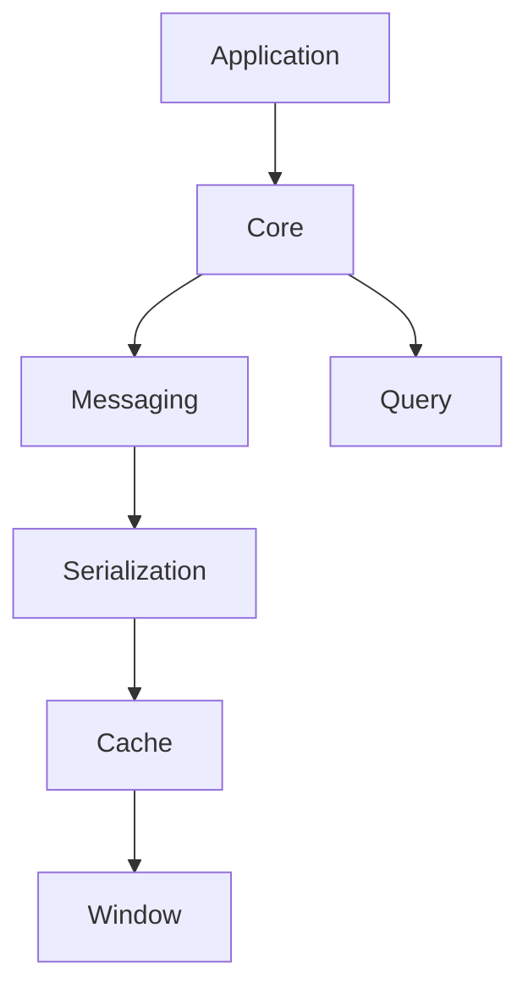

# Kafka.Ksql.Linq OSS 統合責務サマリ

---

## 🔎 全体構造・namespaceごとの一言責務

| Namespace         | 主な責務（1行サマリ）                                                 |
|-------------------|--------------------------------------------------------------------|
| **Query**         | LINQ式からKSQLクエリへの変換・クエリ構築                            |
| **Core**          | Kafka/KsqlDB用エンティティ・モデル管理、基盤設定・属性定義           |
| **Messaging**     | 型安全なProducer/Consumer抽象、DLQ・エラーハンドリング               |
| **Serialization** | Avroスキーマ生成・シリアライズ/デシリアライズ、Schema Registry連携   |
| **Cache**    | ストリーム処理の状態管理（RocksDB等）、ウィンドウ確定データ永続化    |
| **Window**        | 時間窓（Window）処理と集約・ウィンドウ確定の全体管理                 |
| **Mapping**       | POCO ⇄ key/value 変換専用ユーティリティ                         |
| **Application**   | KsqlContext構築・上位層統合（Builderパターンによる初期化・設定管理） |

---

## 🗂️ 責務分割の原則・運用ルール

- **責務の逸脱NG例**  
  - Messagingでシリアライズ処理を直接行わない  
  - Query内でKafka通信やDLQ処理は行わない  
  - Cache実装はWindowの外に出さない
- **依存関係は「上位→下位」限定**  
  - 例：Application → Core → Messaging/Serialization → Cache/Window
- **責務に迷った場合は、必ず本サマリ＋各詳細ドキュメントで確認すること**

---

## 🔗 依存関係図（簡易版）

📝 代表的な処理の責務マッピング
トピック・エンティティ定義／管理 … Core

KSQLクエリ生成・変換 … Query

メッセージ送受信・DLQ管理 … Messaging

Avroスキーマ生成・Schema登録 … Serialization

ストリーム状態同期・永続化 … Cache

時間窓集約・確定・永続化 … Window

全体初期化・統合設定 … Application

⚠️ 責務分割で“迷いやすいポイント”例
MessagingとSerializationの役割分担
　→ Messagingは通信抽象・型安全性、Serializationはスキーマ変換とシリアライズ本体

QueryとCoreの分離
　→ Queryは「クエリ変換」だけ、Coreは「エンティティ/属性/設定管理」

WindowとCacheの境界
　→ Windowは「時間窓の集約と確定」、Cacheは「確定データの永続化・同期」

📚 詳細は各namespaceドキュメント参照
Query … LINQ→KSQLクエリ責務【query_namespace_doc.md】

Core … エンティティ・モデル管理【core_namespace_doc.md】

Messaging … Producer/Consumer抽象・DLQ【messaging_namespace_doc.md】

Serialization … Avro/Schema Registry対応【serialization_namespace_doc.md】

Cache … ストリーム状態・RocksDB連携【cache_namespace_doc.md】

Window … 時間窓集約・確定処理【window_namespace_doc.md】

Application … KsqlContext/統合設定【application_namespace_doc.md】